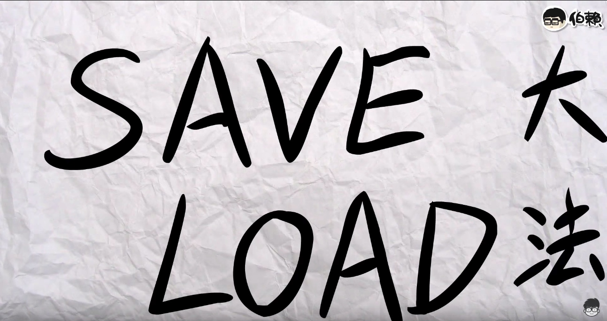
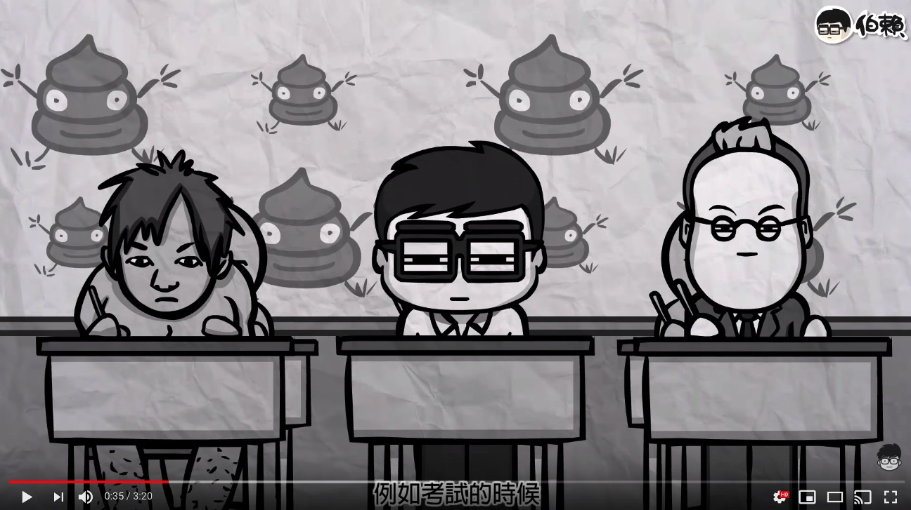
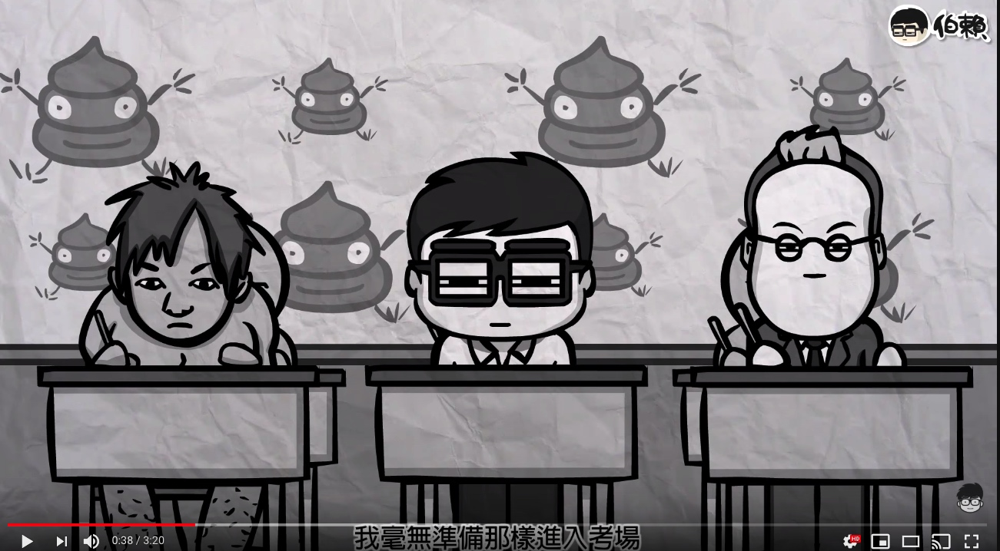
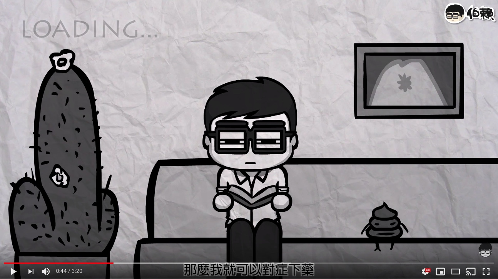
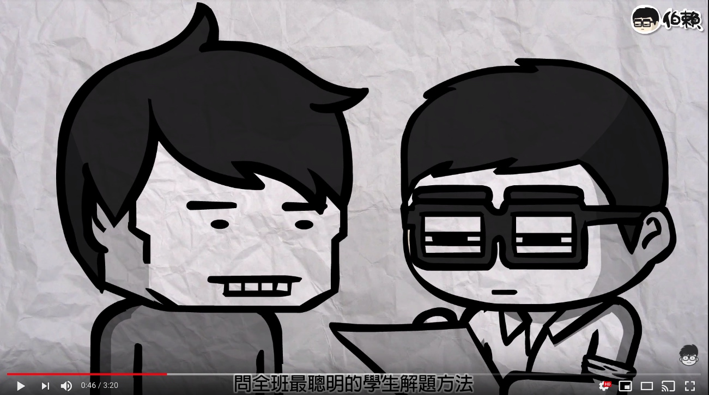
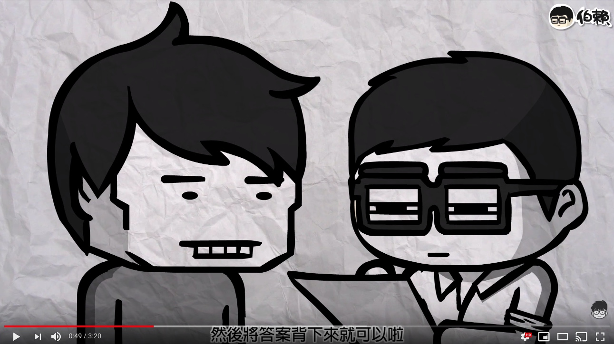
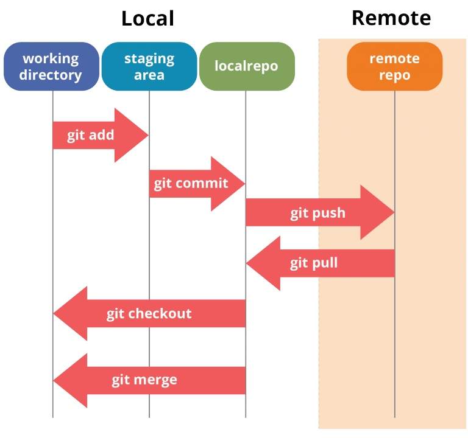

# Video 1 介紹 - Git 是什麼？ Git 如何幫助開發？

Git 是一個版本控制系統 (version control system)，Git 作者為 Linus Torvalds，Linus 同時也是 Linux 作業系統的作者。 

什麼是版本控制系統呢？

其實就像遊戲裡面的 Save Load 大法，如果你不太清楚 Save Load 是什麼的話，這邊有個影片，看完你就懂了。

https://www.youtube.com/watch?v=M0Okq-BUGMs

## 分散式版本控制系統 

(from https://medium.com/@shambhumehta/git-essentials-for-developers-distributed-is-the-new-centralized-5cb2221a058b)

