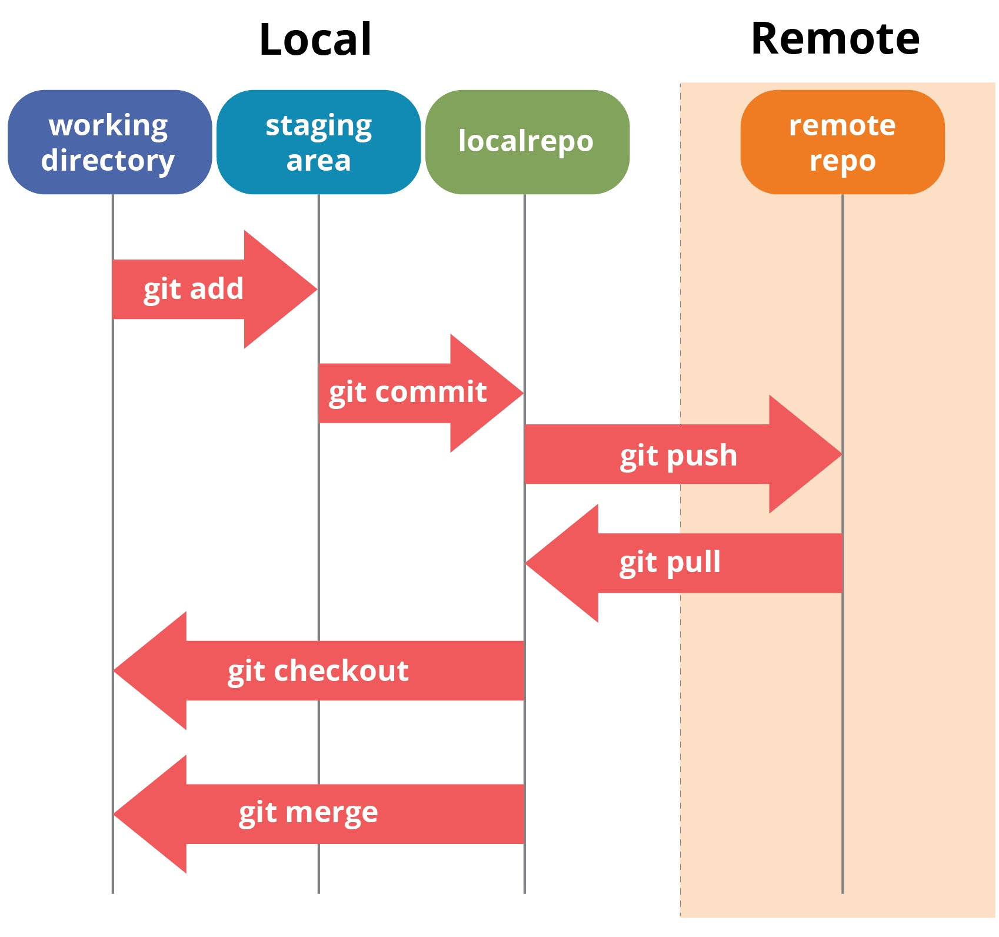
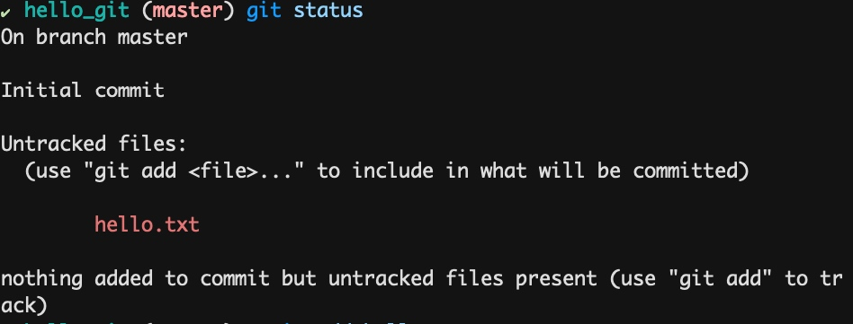
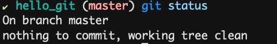

# Video 2 Git 挑戰 #1 #2 #3

挑戰 1 - 安裝 Git
挑戰 2 - 建立你的第一個 Git Repository 
挑戰 3 - 熟悉 Git 基本指令，將 Git 加入開發流程

## 挑戰 1 - 安裝 Git

安裝 Git

Windows 和 Mac 都一樣，下載安裝 
https://desktop.github.com/ 

## 挑戰 2 - 建立你的第一個 Git Repository 

建立資料夾 
mkdir hello_git 

進入資料夾
cd hello_git

git init

## 挑戰 3 - 熟悉 Git 基本指令，將 Git 加入開發流程

from: https://www.edureka.co/blog/git-tutorial/

## Git Go Go Go!!

### 第一個 Commit 

建立一個檔案 hello.txt 

git status 查看狀態，會發現狀態如下

`git add .` 加入資料夾內所有的檔案加入 

再次輸入 `git status` 查看狀態

接著輸入 `git commit -m "add new file hello.txt"` 

再次輸入 `git status` 查看狀態

### 安裝 Source Tree 

https://www.sourcetreeapp.com/

