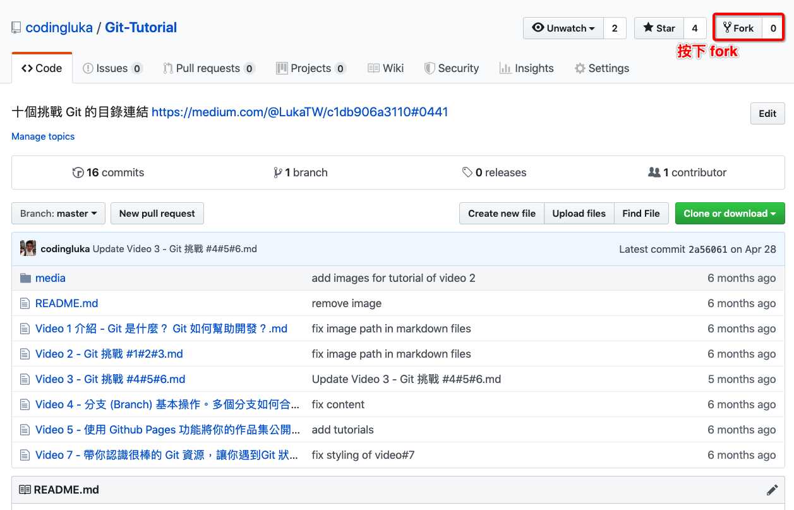
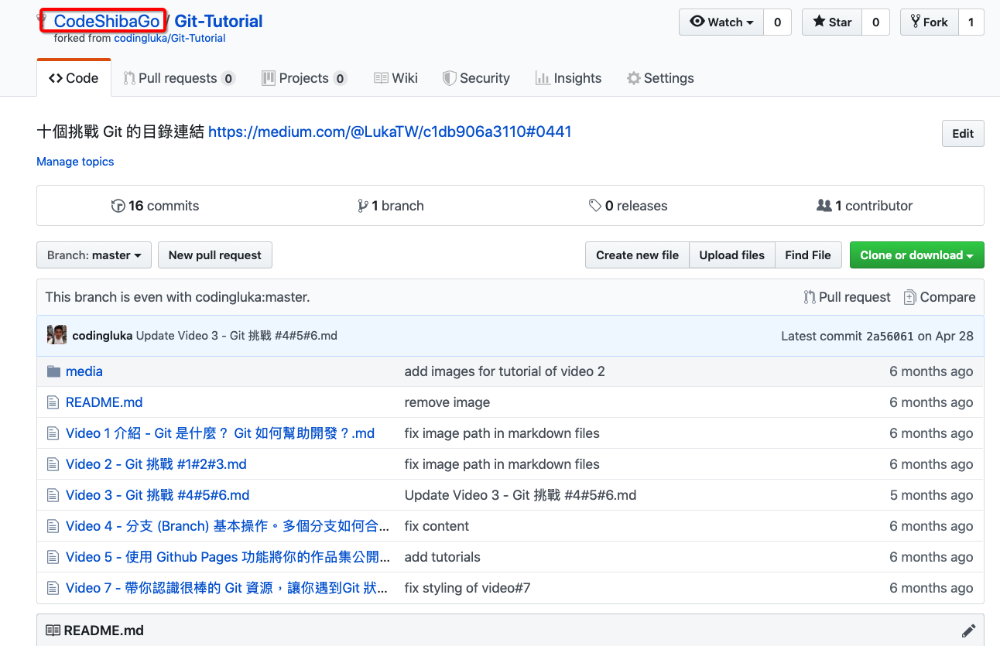
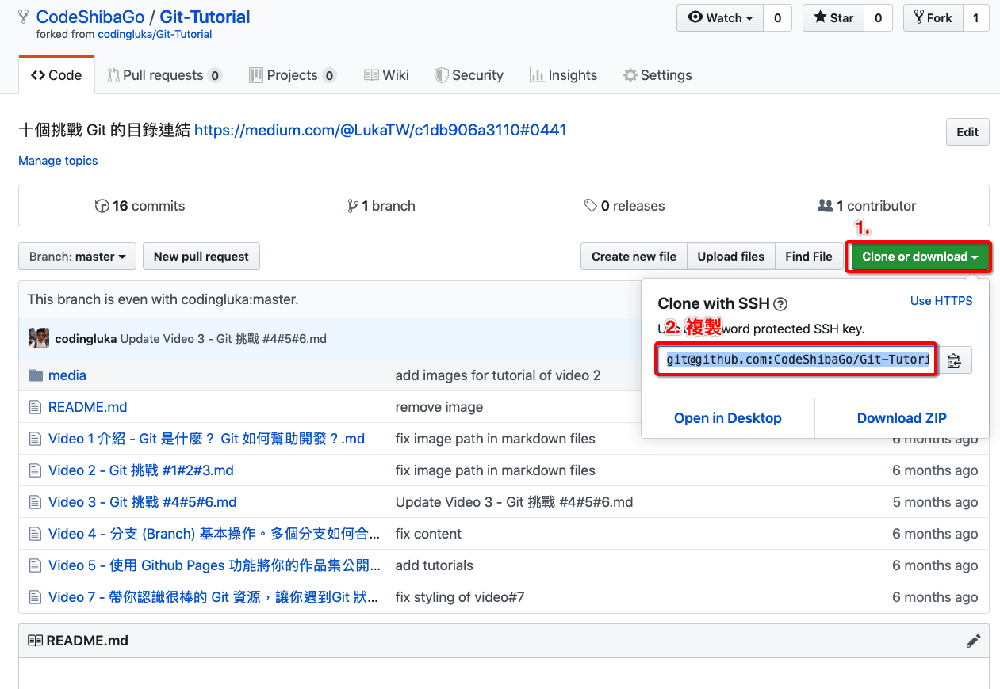
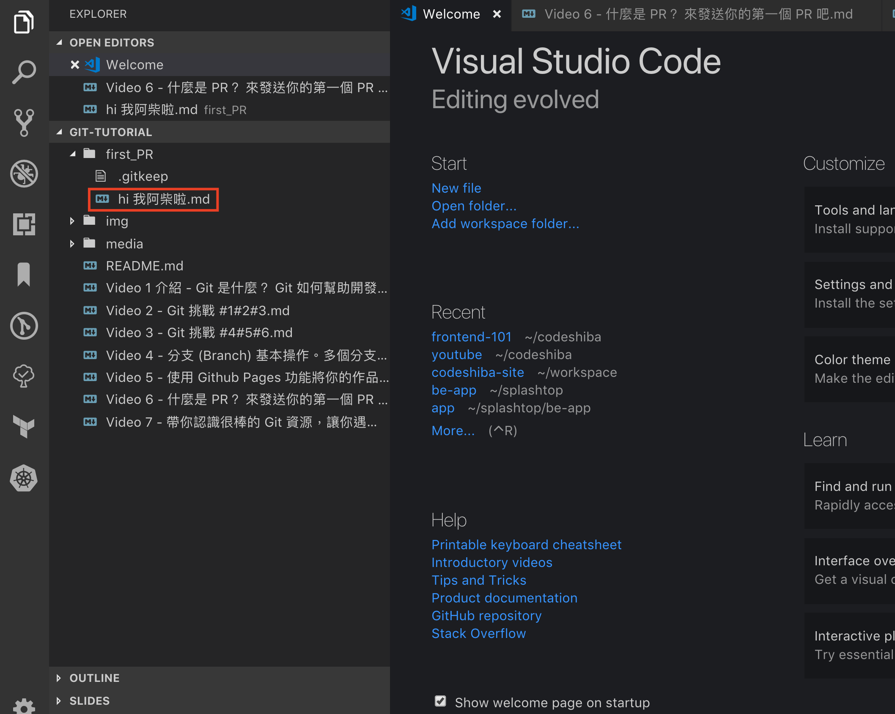
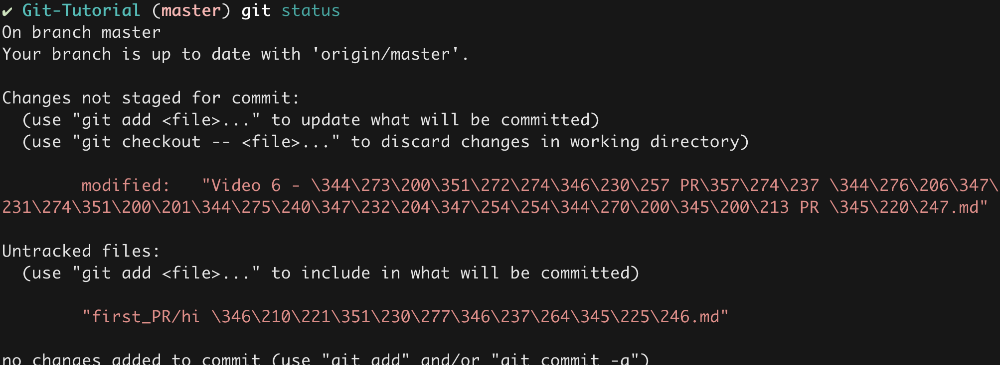
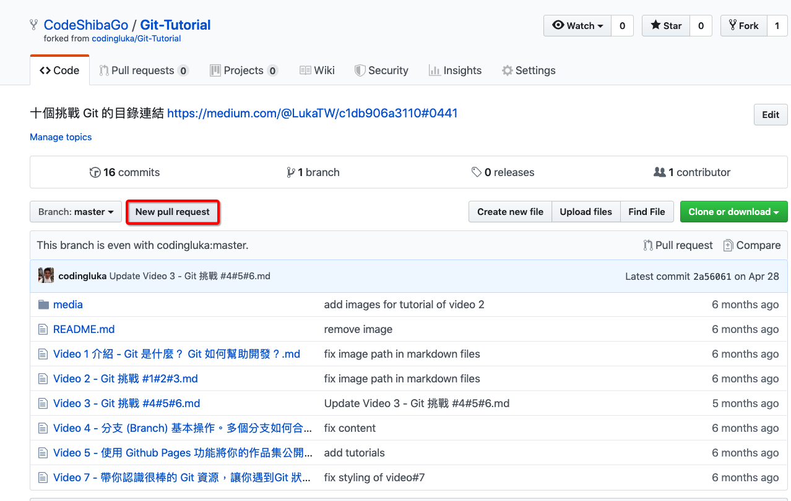

# 挑戰 9 - 什麼是 PR (Pull Request)？ 來發送你的第一個 PR 吧

## 貢獻開源專案 Contribute to Open Source Project

1. 遇到問題的時候可以開 Issue
2. 原作者覺得 ok 之後，你就 fork 一份 Repository 到自己的 github
3. 做完之後，發一個 PR 給原作者
4. 原作者覺得 ok 的話，就會把你的 PR Merge 進原作者的專案。

## 現在來發你的第一個 PR 吧

這個名詞大家可能常聽到，但是不知道什麼意思，那經過這次的教學你就知道了。

### step 1 - 大家先 fork 我的專案，我一步一步教大家怎麼做。

首先按下 fork 鍵



之後你的帳號底下就會有一個跟我一模一樣的 Repo。



### step 2 - Clone 你自己帳號下的 Repository



格式會如下

```
git clone git@github.com:你的帳號/Git-Tutorial.git
```

### step 3 - 在本地端修改你的檔案

複製完之後在本地端新增一個檔案名稱，某某某發第一個 PR。我的話是「hi，我阿柴啦」



修改完成後，在 terminal 輸入 `git status` 查看狀態



輸入 `git add .` 把新增的檔案加入後，再輸入一次 `git status` 查看狀態


接著輸入

```
git commit -m "某某某的第一個 PR"
```

或是

```
git commit -m "一句你想說的話"
```

### step 4 - git push 把修改上傳至自己的 github

完成後 `git status` 看一下狀態

沒問題的話輸入 `git push`，更新自己的 github。

如果成功的話，在 Github 上會看到自己剛剛的修改 - 就是在 First PR 資料夾中新增了一個檔案。

### step5 - 發送 PR 到我的 Repo

在你 fork 出來的 Repo，按下發送 PR 鍵



